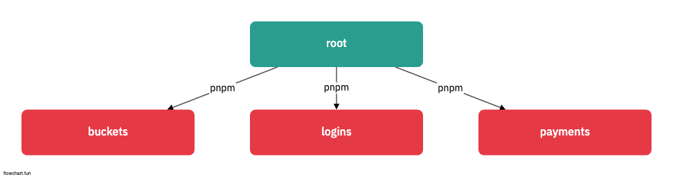

# pnpm-monorepo 구축

## Todo

- [x] monorepo 구축
- [ ] Turborepo CI 구축

## Prestart 1. pnpm 설치

- <a href="https://pnpm.io/installation"> pnpm 설치 홈페이지 </a>

## 1. pnpm setting

```sh
    ## root
    pnpm init
    touch pnpm-workspace.yaml
```

## 2. Project Setting

- 현재 폴더위치 기준 Folder들을 pnpm-workspace에 Setting 합니다.

```sh
    ## Example pnpm-workspace.yaml
    packages:
    - 'apps/*'              ## Front, Backend
    - 'packages/*'          ## 공용 코드 및 라이브러리

    ## 보통의 파일 시스템을 아래와 함께 통일 합니다
    root
        |- apps
            |- [project-1]
            |- [project-2]
            |- [project-3]
        |- packages
            |- [project-1]
            |- [project-2]
```

## 3. Project Setting

- apps/ 하위에 3개의 MSA 프로젝트가 있다고 생각하면

  ```sh
      pnpm init
      pnpm install
  ```

- 하위에 pnpm-lock.yaml이 구성됨

```yaml
lockfileVersion: '6.0'

settings:
  autoInstallPeers: true
  excludeLinksFromLockfile: false

importers:
  .: {}

  apps/buckets: {}

  apps/logins: {}

  apps/payments: {}
```

## 4. pnpm filter를 활용한 root 접근



[pnpm-package.json](./package.json)

## 5. 공용모듈 사용하기

- 공용에서 사용하는 모듈의 package.json 설정

```json
{
  "private": "true", // Private 설정
  "name": "fp",
  "version": "1.0.0",
  "description": "",
  "main": "index.js",
  "scripts": {
    "test": "echo \"Error: no test specified\" && exit 1"
  },
  "keywords": [],
  "author": "",
  "license": "ISC"
}
```

- package/fp 에 있는 함수들을 apps/\* 전체 공유한다고 할때

```sh
    pnpm add [공용-모듈] -F [공용-모듈] -workspace
    pnpm add fp -F logins -workspace
    pnpm add fp -F buckets -workspace
    pnpm add fp -F payments -workspace

    pnpm run login:start
```

```yaml
importers:
  .: {}

  apps/buckets:
    dependencies:
      fp:
        specifier: workspace:^
        version: link:../../packages/fp ## fp 설치

  apps/logins:
    dependencies:
      fp:
        specifier: workspace:^
        version: link:../../packages/fp ## fp 설치

  apps/payments:
    dependencies:
      fp:
        specifier: workspace:^
        version: link:../../packages/fp ## fp 설치

  packages/fp: ## bucket, logins, payments 모듈 공유
    devDependencies:
      buckets:
        specifier: workspace:^
        version: link:../../apps/buckets
      logins:
        specifier: ^1.0.1
        version: 1.0.1
      payments:
        specifier: ^2.0.1404
        version: 2.0.1404
```

- 만약 최근 버전을 원한다면

```sh
  ## current version
  "dependencies": {
    "fp": "workspace:^"
  }

  ## latest version
  "dependencies": {
    "fp": "workspace:*"
  }
```

## 6. pnpm 전체 명령어 사용하기

```sh
    ## 각 하위 모듈의 build 명령어가 존재한다면,
    pnpm run -r build
    pnpm run --parallel -r build ## Parallel
```
