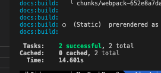

# pnpm + turberepo

## Why Turborepo

> Power Caching

- 
- 

> Simple CLI

```sh
  ## pnpm (기존 pnpm 으로 하나하나 설정해야 함)
  pnpm init
  touch pnpm-workspace.yaml
  ...

  ## turborepo
  pnpm dlx create-turbo@latest
```

> Simple Outputs

```json
{
  "name": "@repo/ui",
  "version": "0.0.0",
  "private": true,
  "exports": {
    "./button": "./src/button.tsx", // export button
    "./card": "./src/card.tsx", // export card
    "./code": "./src/code.tsx" // export code
  },
  "scripts": {
    "lint": "eslint . --max-warnings 0",
    "generate:component": "turbo gen react-component"
  },
  "devDependencies": {
    "@repo/eslint-config": "workspace:*", // Reference @repo/eslint-config
    "@repo/typescript-config": "workspace:*", // Reference @repo/typescript-config
    "@turbo/gen": "^1.10.12",
    "@types/node": "^20.5.2",
    "@types/eslint": "^8.44.7",
    "@types/react": "^18.2.0",
    "@types/react-dom": "^18.2.0",
    "eslint": "^8.53.0",
    "react": "^18.2.0",
    "typescript": "^5.2.2"
  }
}
```

## pnpm + turborepo 구축

```sh
pnpm dlx create-turbo@latest

> @server
> pnpm workspace
```

## Reference

- <a href="https://turbo.build/repo/docs/core-concepts/monorepos"> turborepo monorepo </a>
